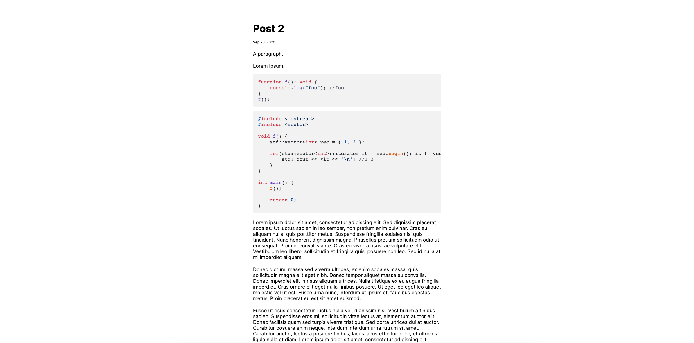

<h1 align="center">🌼 Lilian</h1>




<p align="center">Welcome to Lilian, a minimal blog template.</p>

<p align="center">You can create your own minimal blog with very little configuration.</p>

# Table of Contents

1. [Installation](#installation)

2. [Setup](#setup)

3. [Features](#features)

4. [Frequently Asked Questions](#frequently-asked-questions)

5. [Contributions](#contributions)

6. [License](#license)

# Installation

Clone the repository

```bash
git clone <SSH/HTTPS URL>
```

Change directory

```bash
cd <...>/Lilian
```

Install npm dependencies

```bash
npm install
```

# Setup

1. Run lilian-init. This will do a basic clean up of files (not including `_index.md`).

```bash
# via npm
npm run lilian-init

# or

# via make
make lilian-init
```

2. Update `_index.md` in `posts/index` directory to your liking. No frontmatter is necessary for the index, therefore `nil` is the value for each property.

3. Create a post in the root directory of `posts`. Please follow the post template as shown in `post-template.md`, located in `posts/template`. Lilian will throw errors if your posts are not structured correctly.

3. Run Lilian.

```bash
# via npm
npm run lilian

# or 

# via make
make lilian
```

Run local dev server using Vite.

```bash
# via npm
npm run dev

# or 

# via make
make dev
```

**Note:** All HTML files are minified, so you have to edit the contents in the respective `.md` files or the template literals in `createPostListHtmlTemplate()` and/or `createPostHtmlTemplate()` functions within `src/post-util.ts`.

# Features

1. Pages are generated locally.

2. Perfect amount of simplicity:

- [Inter](https://github.com/rsms/inter) font
- No UI distractions, no heavy dependencies
- Default theme leaves room for customization
- Comfortable default font size for reading
- Comfortable default mobile and desktop styles

# Frequently Asked Questions

The FAQ will be updated periodically.

1. Q: I know Lilian is a blog template, but how does it work without utilizing a site generator or framework?

    A: Lilian is powered using a handful of utilities that are executed locally. You can find them in `src/utils`.
    
    Here is a gist of how these utilities work (in no particular order):
    
    1. Using functions from [Eva-ST-Util](https://github.com/alexwkleung/Eva-ST-Util) allows you to work with Markdown, such as manipulating the AST. Also, the string from Markdown -> HTML is used later.
    
    2. Extract the frontmatter data for each post and store them into a matrix (2D array).

    3. Create a data structure involving matrices (i.e., multiple 1x3 matrices) that contain the post data (frontmatter, post content, file names). 

    4. Sort the matrix by date (parsed to milliseconds for comparison) using an implemented sorting algorithm (i.e., bubble sort).

    5. Create HTML template strings (index, posts, post list, etc). 

    6. Generated HTML files are minified using html-minifier-terser.

    7. Using functions from [fs-dir](https://github.com/alexwkleung/fs-dir) allows executing file system operations with ease, such as filtering and removing file extensions.
    
    These aren't the most optimal solutions but I will be improving the efficiency in the near future. Of course, this will change over time and I'll be sure to update this list.

2. Q: Does Lilian offer blog features such as pagination, post search, RSS, etc?

    A: At the moment, Lilian does not offer pagination, post search, RSS, user comments, theme switching, etc. While these features are nice to have, Lilian is not meant to be a replacement of [insert site generator/blog util here]. However, once Lilian's core is more stable, I plan on adding these features as additional utilities that can be imported into `post-util.ts`.

# Contributions

Contributions are welcomed, but is 100% optional.

Feel free to submit a [new issue](https://github.com/alexwkleung/Lilian/issues) or a [pull request](https://github.com/alexwkleung/Lilian/pulls) if you have any improvements or concerns.

# License 

[MIT License.](https://github.com/alexwkleung/Lilian/blob/main/LICENSE)